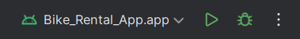

# Bike Rental App

This repository contains source code for the Android app of the Bike Rental App
project. Recommended to run and inspect with
[Android Studio](https://developer.android.com/studio)

_**Link to repository of the back-end for this project: [bike-rental-app_be](https://github.com/Thomas-Hoang-04/bike-rental-app_be)**_

### Contributor

- **Hoàng Minh Hải** - _GitHub:
  [Thomas-Hoang-04](https://github.com/Thomas-Hoang-04)_
- **Đỗ Mạnh Cường** - _GitHub: [cuongceg](https://github.com/cuongceg)_
- **Phạm Việt Hòa** - _GitHub: [phamhoa2416](https://github.com/phamhoa2416)_
- **Nguyễn Văn Trường** - _GitHub: [nvtruon](https://github.com/nvtruon)_

### Tools & Techstack

<p>
  
  
  
  
  
  
  
  
  
</p>

### Guidelines

1. To run this project, open Terminal, point to a desired directory, and clone
   the project with the provided command

   ```
   git clone https://github.com/Thomas-Hoang-04/bike_rental_app.git
   ```

2. Download [Android Studio](https://developer.android.com/studio)

3. Open the project with Android Studio. The IDE will automatically sync the
   project with included build files and import/download necessary dependencies.

   If the project does not sync upon being imported to Android Studio, use this key
   combination `Ctrl+Shift+O` or `Cmd+Shift+O` _(for MacOS)_

4. Once the process complete, find the section described in the image below and
   press the Play button to build and run the app

   

   Android Studio will set up a default Android virtual device (AVD) for the app
   to run on. You could also create your custom devices or set up a real device
   for debugging

### Project Structure

```
├── app/src/ - Main project code ("app" module)
    ├── androidTest/ - Test snippet for Android specific functions
    ├── main/ - Source codes & Android app resources
        ├── java/com/example/bikerentalapp - Android app primary package
            ├── api/ - Store data models & scripts to connect to the back-end
                ├── data/ - Contains data models
                ├── network/ - Scripts to communicate with back-end REST API
            ├── components/ - UI Components for general uses
            ├── keystore/ - Scripts to set up Android Keystore & Encrypted Jetpack Datastore
            ├── model/ - ViewModels for user infomation, log in and sign up
            ├── navigation/ - App navigation graph & utility components
            ├── screens/ - UI & Logic of all screens in the Android app
            ├── ui/theme - Default Material Theme preferences
            ├── MainActivity.kt - Entry points of the app
        ├── res/ - Android app general resources (images, fonts, colors, theme, ...)
    ├── test/ - General unit test snippets
    ├── build.gradle.kts - Gradle build file for the primary "app" module
├── gradle/ - Gradle dependencies map
    ├── wrapper/ - Gradle environment variables & metadata
    ├── lib.versions.toml - Declarations and metadata of plugins/libraries used throughout the app
├── .gitignore - List of files & directories ignored by Git versioning
├── build.gradle.kts - Gradle build file for the entire project
├── local.properties - Store local environment variables
├── LICENSE - Apache-2.0 license for this app
├── README.md - This documents
├── settings.gradle.kts - Gradle build settings
```
